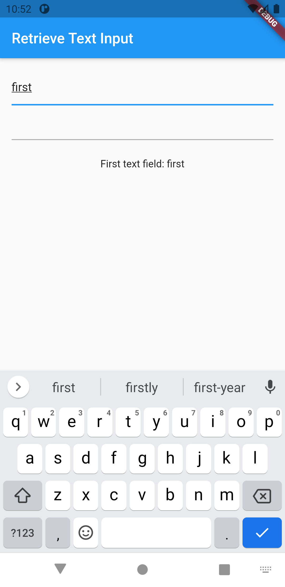
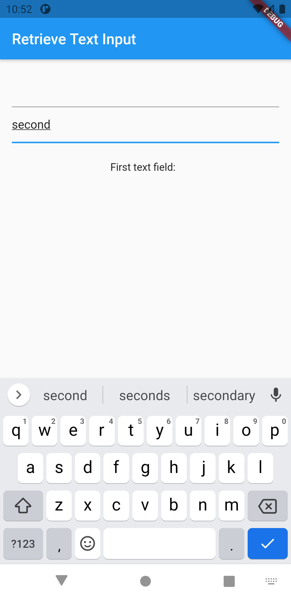

# handle_changes_text_field

1. Supply an onChanged() callback to a TextField or a TextFormField

2. Use a TextEditingController

3.  Create a TextEditingController

4.  Connect the TextEditingController to a text field

5.  Create a function to print the latest value

6.  Listen to the controller for changes

7.  Interactive example

In some cases, it’s useful to run a callback function every time the text in a text field changes. For example, you might want to build a search screen with autocomplete functionality where you want to update the results as the user types.

<table>
  <tr>
    <td>First</td>
     <td>Second</td>
  </tr>
  <tr>
    <td></td>
    <td></td>
 
  </tr>
 </table>